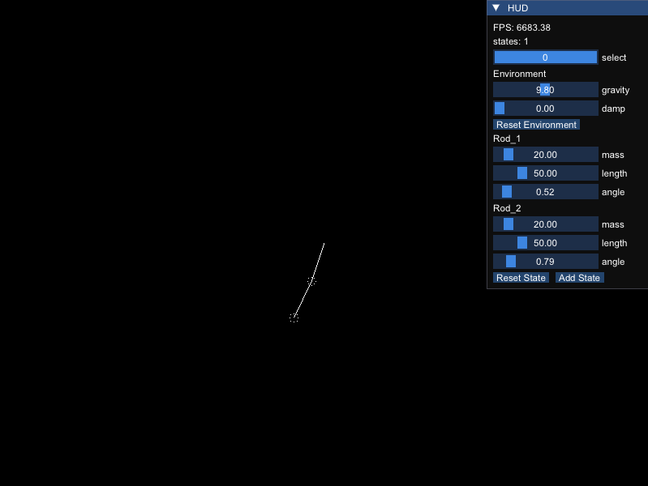

# Double-Pendulum
Double Pendulum Simulation using C++23, Dear-ImGui and SFML



## Description
A simulation of the double pendulum using a modified version of Velocity Verlet where acceleration also depends on velocity [see here](https://gamedev.stackexchange.com/a/41917). The UI has been made using [Dear ImGui](https://github.com/ocornut/imgui) and [ImGui-SFML](https://github.com/SFML/imgui-sfml) for sfml bindings of imgui. This project focus mainly on making good software designs.

## How to build
First clone the repo
```bash
$ git clone --recursive <REPO_LINK> # recursive flag to also initialize submodules
```
### Requirements
- C++23 compiler: `clang-21.1.5`, `gcc-15.1.2`
- CMake >= 3.21
- SFML-3
- Dear-ImGui-1.19.5
- ImGui-SFML-3

### Building
1. Create a `build` directory in current project directory
    ```bash
    $ mkdir build
    ```
2. Generate build files and build the project
    - For single config generators like `make`
    ```bash
    $ cmake -S . -B build -DCMAKE_BUILD_TYPE=Release
    $ cmake --build build
    ```
    - For multi-config generators like `ninja` or `Visual Studio`
    ```bash
    $ cmake -S . -B build
    $ cmake --build build --config Release
    ```
3. Navigate to `build/src` and run the executable