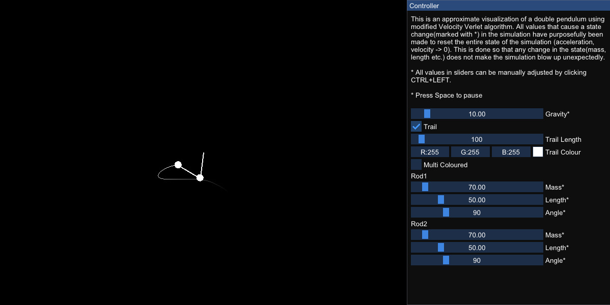

# Double-Pendulum
Double Pendulum Simulation using C++20 and SFML



## Description
This Project has been made solely for the purpose of learning more about SFML and C++20 and simulations. Although it implements C++20, lot of the code and syntax still use older C++ styles like raw pointers. In future releases, the code will be gradually updated to more modern C++ style and syntax and also to SFML-3.0.

#### Current features :
* CLI - interface to provide initial conditions for the pendulum.
* No GUI support for manipulation of the paramenters
* Uses RK4 integrator.

#### Future releases :
* GUI support to manipulate the paramenters. CLI support will not be removed.
* Changing integrator from RK4 to Verlet because it is more stable and less computationally intensive.

> P.S.- I am extremely new to C++ build sytems and it is a nightmare to deal with, so if the CMake scripts don't work for your end please raise an issue and if you found any solution to mitigate the above create a pull request, shall try to review and merge it as soon as possible.

## How to install
If you are on Windows you can directly go to [Release](https://github.com/RougherO/Double-Pendulum/releases/tag/v1.0.0) section and choose the Windows zip folder extract it and execute the exe file from console. See [How to use](#how-to-use)

It is unfortunate that I do not have enough knowledge to distribute projects in the form of AppImage or Flatpaks for Linux at this point so building from source is recommended to prevent any dependency issue. You can expect the next release to have a Linux AppImage version.

For Linux folks [building the project](#building) is the recommended route for now.
## How to build
### Requirements
1. `C++ version >= 20` :

    Check your compiler version, if it has support for c++20. 
2. `cmake >= 3.21` :

    Check if you have Cmake installed by running
    ```bash
    $ cmake --version
    ```
    If it is not available then install CMake from [here](https://cmake.org/download/ "Download CMake here") depending on your OS. Add it to your PATH environment variable.

    If you are on Linux, you can use the one provided by your package managers.
3. `SFML = 2.6.x` :

    The provided CMakeLists.txt by default installs SFML for you using `FetchContent()` in the build directory you provide and links them to the executable. If you already have SFML installed with version 2.6 in standard path then you can disable this behaviour and then build the project.

### Building
1. Create a `build` directory in current project directory and then create a Debug and Release directory under it.

    ```bash
    $ mkdir build
    $ mkdir build/Debug && mkdir build/Release
    ```
Select Debug or Release build: 

2. * For a Release build:    

    ```bash
    $ cmake -S . -B build/Release
    $ cmake --build build/Release --config Release
    ```
    * For a Debug build:

    ```bash
    $ cmake -S . -B build/Debug
    $ cmake --build build/Release --config Debug
    ```
    This will build for the default builder you have [Makefile or Ninja or MSVS etc]. You could specify a builder by adding a -G flag, for example to create build files for Ninja:
    ```bash
    $ cmake -G "Ninja" -S . -B build/[Debug/Release]
    ```
3. Navigate to `build/Debug` or `build/Release` and run the executable

    ```bash
    $ cd build/Release[Debug]
    $ ./DoublePendulum (Linux) ./DoublePendulum.exe(Windows)
    ```
## How to use
Like in previous steps normally executing the file will start the app from a default state, like default length of pendulum, mass etc. These values can be changed from console using respective flags.

An example run on Linux would look like:
```bash
$ ./DoublePendulum -l1 120 -t 200
```
Here's a list of commands and there possible range of values:
> Note: If the entered value is _beyond these ranges (bounds are exclusive) they are automatically ignored and set to default and unknown options are also ignored_ as this cli parser is extremely rudimentry which I have implemented myself.

|  Options | Lower Bound | Upper Bound   | Purpose                            |
|----------|-------------|---------------|------------------------------------|
| l1 or L1 | 0           | 500           | Set length of rod 1                |
| l2 or L2 | 0           | 500           | Set length of rod 2                |
| m1 or M1 | 0           | 500           | Set mass of rod 1                  |
| m2 or M2 | 0           | 500           | Set mass of rod 2                  |
| a1 or A1 | no bound    | no bound      | Set starting angle of rod 1        |
| a2 or A2 | no bound    | no bound      | Set starting angle of rod 2        |
| g or G   | 0           | 100           | Set gravity                        |
| t or T   | 0(inclusive)| 500(inclusive)| Set trail length (OFF if set to 0) |

Specify these options while executing the program from command line.
That's it!

_If you like this project be sure to star it_ :)
